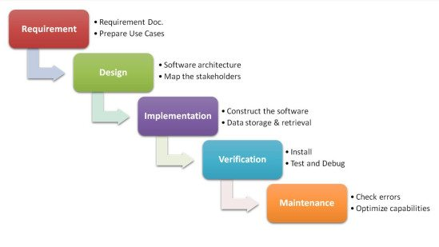
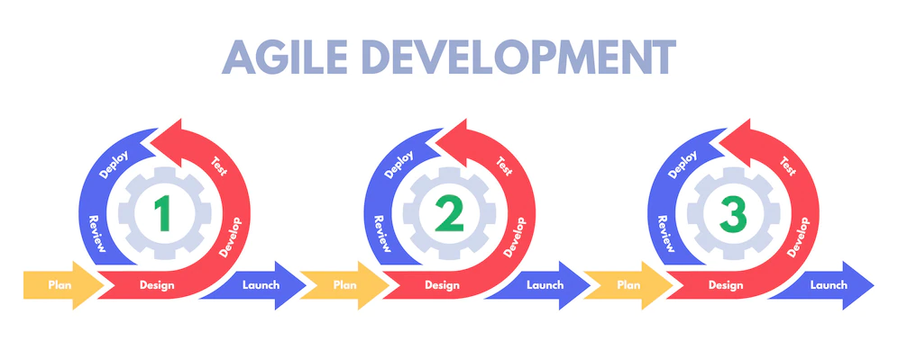

# Scrum

## Contextualização

O desenvolvimento de software, geralmente, ocorre para atender alguma demanda (obedecendo as regras de negócio) de onde são listadas requisitos, e partir delas é que ocorre o trabalho propriamente dito, em suas diferentes etapas (concepção, análise, design, desenvolvimento, testes e implantação). Por vezes é um processo trabalhoso e que requer bastante recurso. Toda essa "trabalheira" por vezes gera um software no qual 20% das funcionalidades resolvem 80% dos problemas (Regra do Pareto).

## Desenvolvimento Waterfal x Ágil

### Desenvolvimento em Cascata (Waterfal)

O modelo em cascata (waterfal) divide o desenvolvimento de software em 5 etapas (Requerimento, Design/Projeto, Implementação, Verificação/Testes e Manutenção) e conclui elas sequencialmente, de modo que só se avança para a segunda etapa com a conclusão da primeira etapa e assim sucessivamente. Caso seja necessário alguma alteração em algum elemento oriundo da uma etapa anterior, deve-se retornar para o início da cascata. Um aspecto positivo é que você precisa preocupa-se somente um tipo de atividade por vez e somente uma vez, caso não haja erros ou necessidades de alterações.

### Desenvolvimento Ágil

O modelo de desenvolvimento ágil diferencia-se do modelo em cascata por não ser centralizado em etapas, mas sim em funcionalidades. Em certo sentido, as etapas do modelo em cascata também estão presentes no desenvolvimento ágil, todavia há uma "cascata" para cada funcionalidade do sistema, ou seja, há vários "mini-ciclos" de desenvolvimento. Vale a pena pensa nisso como a lógica do  MVP (Minimum Product Viable) e evouluir a partir dele. O termo "ágil" aqui não significa que ele é necessariamente mais rápido na entrega do produto que o modelo cascata, mas sim que em caso de mudanças, em geral, é fácil de responder a elas.

## SCRUM

O SCRUM é um framework de gerenciamento de projetos com metodologias ágeis, em geral com aproveitando-se de equipes multidisciplinares. O SCRUM possui três pilares:

- Transparência: valorização da comunicação entre os membros da equipe para que todos tenham em mente uma ideia clara do que é o projeto e o que os outros membros pensam a respeito, e assim garantir transparência dentro da equipe desenvolvedora. Além disso demonstrar e receber constantes feedbacks do cliente.
- Adaptação: os requisitos do software podem mudar ao longo do desenvolvimento
- Inspeção: os membros da equipe apresentam o que estão fazendo quanto ao desenvolvimento do software

## Papéis e Responsabilidades de cada um do time

### Product Owner (PO)

Pessoa (e não comitê) que representa a área de negócios, definindo as funcionalidades do software (product backlog), priorizando as funcionalidades e garantindo que o resto da equipe entenda o que o software de fato deve ter. Tem a visão do que será desenvolvido,as necessidades a serem atendidas, o público-alvo, de qual é o valor que o software vai agregar, sendo também responsável por validar o que foi feito pelo time de DEVs.

### Scrum Master (SM)

Responsável por garantir o uso correto do SCRUM, não sendo um Gerente de Projetos, agindo como um facilitador, ajudando ao PO no planejamento e estimativas do backlog, ajuda na remoção de impedimentos, e treina a equipe em autogerenciamento e interdisciplinaridade.

### Time de Desenvolvimento (DEV)

Equipe multidisciplinar que possui habilidades para desenvolver, testar, criar e desenhar tudo o que é necessário para a entrega do software.

## Cerimônias no SCRUM

Time Box: Tempo máximo para fazer uma cerimônia ou Sprint.

Composição de uma Sprint (de 30 dias):

- Planejamento da Sprint: participação de todo o time, na qual o PO passa para os DEVs o "O que deve ser feito?" e em seguida os DEVs fragmentam as ativadades para definir, do ponto de vista técnico, o "Como pode ser feito?", dando um feedback informando se é possível entregar tudo dentro do tempo definido para a Sprint. (Time Box: 4h para "O que deve ser feito?" e 4h para "Como pode ser feito?")
- Reuniões Diárias (Daily Meeting): participação do time DEV e do Scrum Master. É feita para responder perguntas como "O que foi feito no dia anterior?", "O que está planejado para hoje?" e "Há algum impedimento no desenvolvimento?", realizada (preferencialmente) em pé para evitar acomodação. Também pode-se utilizar o quadro Kanban para ter uma visão geral do desenvolvimento. (Time Box: 15 min)
- Revisão da Sprint (Review): O time de DEVs apresenta para o PO o trabalho feito no última dia da Sprint. Trata-se de um aceitar ou recusar. (Time Box: 4h)
- Retrospectiva da Sprint: reunião que envolve principalmente envolve o time de DEVs para instigar a transparência a fim de trazer a tona os erros, os desafios, as lições aprendidas, etc. (Time Box: 3h)
